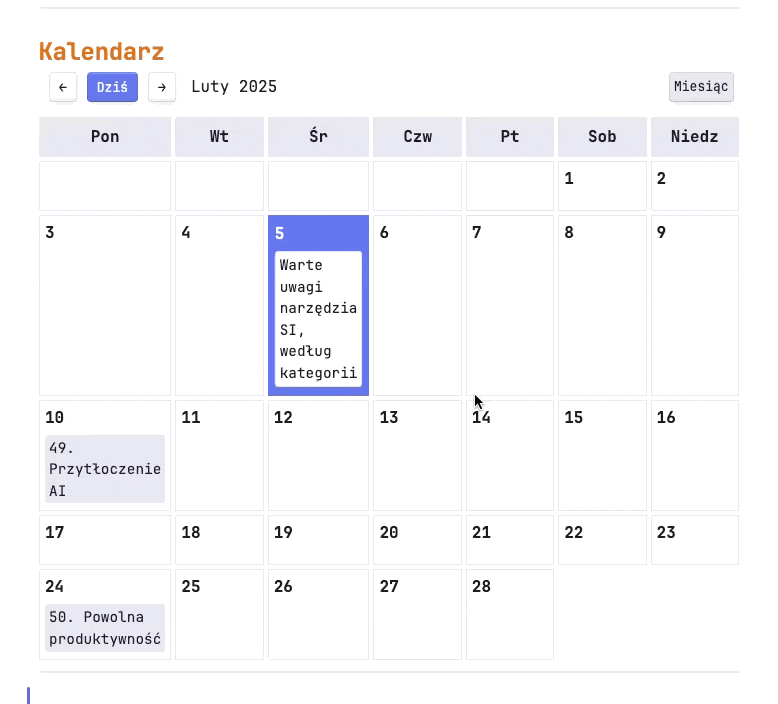

# Obsidian Calendar Planner

Calendar Planner to plugin do Obsidian, który umożliwia wizualizację i zarządzanie notatkami w formie kalendarza. Plugin pozwala na filtrowanie notatek za pomocą tagów i zaawansowanych zapytań wyszukiwania, a także oferuje wygodne przeciąganie i upuszczanie notatek między dniami.

## Funkcje

- 📅 Widok miesięczny i tygodniowy kalendarza
- 🔍 Filtrowanie notatek za pomocą przypisanego tagu
- 🖱️ Przeciąganie i upuszczanie notatek między dniami
- 🎨 Dostosowanie do motywu Obsidian
- 🔄 Automatyczne odświeżanie przy zmianach
- 📌 Przycisk "Dziś" do szybkiej nawigacji
- ⚙️ Konfigurowalne ustawienia

## Demo


## Do zrobienia
- [x] Dodanie bardziej zaawansowanego filtrowania notatek
- [x] Dodanie listy notatek pasujących do filtra, ale bez przypisanej daty
- [x] Możliwość tworzenia powtarzalnych notatek
- [x] Możliwość dodawania kilku filtrów do jednego kalendarza
- [ ] Generowanie odnośników do dat wszystkich powtórzeń
- [ ] Wsparcie dla języka angielskiego (obecnie tylko polski)

## Instalacja
Możesz zainstalować ten plugin korzystając z wtyczki BRAT w Obsidian.
Dodaj ją do swojego sejfu, a później do niej dodaj Calendar Planner, podając adres tego repozytorium.

## Użycie

Aby wyświetlić kalendarz w notatce, użyj bloku kodu:

```markdown
```calendar-planner
tag:#projekt
```

Możesz też skorzystać z dodatkowych opcji, wskazanych poniżej.

### Zawężanie wyników wyszukiwania
Filtrowanie pozwala zawęzić / rozbudować wyszukiwanie. 
Możesz wpisać w wyszukiwanie formułę `tag:#publikacja -tag:#archiwum`, żeby pokazać tylko te publikacje, które nie są oznaczone jako archiwum.
Możesz też wykluczyć folder, który nie ma być uwzględniany w wyszukiwaniu, np. `tag:#publikacja -path:"90 Robocze/Szablony/"`.

~~~markdown
```calendar-planner
tag:#publikacja -path:"90 Robocze/Szablony/"
```
~~~

### Dodanie kilku filtrów do jednego kalendarza
Określając filtry, możesz dodać im nazwy. Jeśli filtrów będzie więcej, niż jeden, to w kalendarzu pojawi się możliwość przełączania pomiędzy nimi.
~~~markdown
```calendar-planner
Publikacje:tag:#publikacja -path:"90 Robocze/Szablony/"
Zadania:tag:#zadanie 
```
~~~

### Pokazywanie niezaplanowanych notatek
Jeśli dodając kalendarz do strony, dopisemy do niech `+unplanned`, to pod kalendarzem pojawi się dodatkowa sekcja "Niezaplanowane".
~~~markdown
```calendar-planner
tag:#publikacja -path:"90 Robocze/Szablony/"
+unplanned
```
~~~

### Przykłady zapytań

- Proste wyszukiwanie po tagu: `#projekt` lub `tag:#projekt`
- Wyszukiwanie w folderze: `path:"Projekty/2024"`
- Złożone zapytania: `tag:#projekt path:"Projekty/"`
- Wykluczanie tagów: `tag:#zadanie -tag:#zrobione`

## Powtarzanie notatek

Plugin umożliwia tworzenie notatek, które mają się powtarzać w określonych odstępach czasu.
Notatka początkowa jest wtedy umieszczona w kalendarzu w swojej pełnej formie, a wszystkie powtórzenia są generowane automatycznie, jako wirtualne notatki.
Wirtualnych notatek nie można przenosić, ale można je kliknąć i otworzyć oryginalną notatkę.

Aby skonfigurować powtarzanie, wymagane jest dodanie parametru `powtarzanie` (zgodnie z ustawieniami pluginu) i ustawienie jej wartości `miesięcznie` lub `rocznie`.


## Ustawienia

Plugin można dostosować w panelu ustawień:

- **Nazwa pola daty**: Określa pole w frontmatter używane do przechowywania daty (domyślnie: "date")
- **Format daty**: Format daty używający składni Moment.js (domyślnie: "YYYY-MM-DD")
- **Domyślny widok**: Wybór między widokiem miesięcznym a tygodniowym
- **Okres powtarzania**: Określa, ile lat do przodu pokazywać powtarzające się notatki
- **Nazwa pola powtarzalności**: Określa pole w frontmatter używane do przechowywania daty powtarzalności (domyślnie: "powtarzanie"). W tym polu możesz wpisać np. "miesięcznie" lub "rocznie"
- **Generuj pole dates**: Testowa funkcja, która dodaje powtarzalnej notatki pole "dates", zawierające linki do dat wszystkich powtórzeń. Niestety obecnie wpływa negatywnie na wydajność pluginu.

## Wsparcie
Jeśli znajdziesz błąd lub masz propozycję nowej funkcji, zgłoś to w tym repozytorium.

## Licencja
Ten plugin jest dostępny na licencji MIT. 